# ShopSmart Recommender — Informe Técnico

**Versión:** 1.0 · **Alcance:** Etapa 1 (EDA, calidad de datos, feature engineering, modelado) y Etapa 2 (evaluación formal, validación, MLOps, demo).

> Este informe es la memoria técnica integral del proyecto. Está pensado
> para que cualquier persona pueda entender qué se hizo, por qué se hizo,
> qué se obtuvo y qué significa, **sin necesidad de abrir los notebooks**.
> Todas las cifras citadas fueron verificadas contra el contenido real del
> repositorio (datasets, notebooks ejecutados, artefactos serializados y
> `mlflow.db`) al momento de escribir este documento.

## Índice

1. [Resumen ejecutivo](#1-resumen-ejecutivo)
2. [Contexto y problema de negocio](#2-contexto-y-problema-de-negocio)
3. [Objetivos del proyecto](#3-objetivos-del-proyecto)
4. [Alcance y limitaciones del proyecto](#4-alcance-y-limitaciones-del-proyecto)
5. [Dataset](#5-dataset)
6. [Metodología general](#6-metodología-general)
7. [Data Quality](#7-data-quality)
8. [Análisis Exploratorio de Datos](#8-análisis-exploratorio-de-datos)
9. [Feature Engineering](#9-feature-engineering)
10. [Estrategia de recomendación](#10-estrategia-de-recomendación)
11. [Modelado](#11-modelado)
12. [Evaluación](#12-evaluación)
13. [Validación](#13-validación)
14. [MLflow](#14-mlflow)
15. [Persistencia de modelos](#15-persistencia-de-modelos)
16. [Pipeline end-to-end](#16-pipeline-end-to-end)
17. [Aplicación Streamlit](#17-aplicación-streamlit)
18. [Resultados finales](#18-resultados-finales)
19. [Interpretación de resultados](#19-interpretación-de-resultados)
20. [Trade-offs técnicos](#20-trade-offs-técnicos)
21. [Limitaciones](#21-limitaciones)
22. [Riesgos](#22-riesgos)
23. [Mejoras futuras](#23-mejoras-futuras)
24. [Conclusiones](#24-conclusiones)
25. [Referencias internas del proyecto](#25-referencias-internas-del-proyecto)

---

## 1. Resumen ejecutivo

ShopSmart Recommender es un sistema de recomendación de productos de
moda y accesorios construido sobre un dataset de Amazon (728 productos,
6.327 reseñas). El proyecto se desarrolló en dos etapas: la Etapa 1
cubrió calidad de datos, EDA, ingeniería de características y el
entrenamiento de dos modelos de recomendación; la Etapa 2 formalizó la
evaluación con pruebas estadísticas, documentó un plan de validación,
construyó un pipeline reproducible con tracking en MLflow, y publicó una
demo interactiva en Streamlit.

El hallazgo estructural que condicionó todo el diseño posterior fue que
`reviews.csv` **no contiene un identificador de usuario/comprador**. Esto
descarta, desde el inicio, un filtrado colaborativo clásico basado en
usuarios. En su lugar, el proyecto implementó y comparó dos modelos:

- **Content-Based** (`ContentBasedRecommender`): recomendación
  personalizada por similitud coseno sobre una representación de 100
  dimensiones de cada producto (texto + categóricas + numéricas).
- **Popularity** (`PopularityRecommender`): ranking no-personalizado
  basado en un score compuesto de rating bayesiano, sentimiento promedio
  y volumen de reseñas — la aproximación de este proyecto a una señal
  "colaborativa-implícita", dado que no hay usuarios individuales que
  modelar.

La comparación offline sobre las 728 consultas del catálogo (K=10) mostró
que el modelo Content-Based domina en personalización (Category
Precision@10 = 0.824, Catalog Coverage@10 = 0.993) mientras que el
modelo Popularity domina en calidad promedio de lo recomendado
(Avg. Quality@10 = 4.726). La diferencia en precisión de categoría se
validó con un test de Wilcoxon pareado (`p ≈ 1.0 × 10⁻⁸²`, n=728),
confirmando que es estadísticamente significativa y no atribuible al
azar. Ningún modelo domina en todas las métricas — la recomendación de
diseño resultante es un enfoque híbrido por posición, no un blend
numérico: Content-Based como motor principal, Popularity como *fallback*
de cold start.

## 2. Contexto y problema de negocio

Un catálogo de comercio electrónico de moda enfrenta dos problemas
simultáneos: (1) ayudar a un comprador a encontrar productos relevantes
dentro de un catálogo con alta variedad de marcas y categorías, y (2)
hacerlo incluso cuando no existe un historial de compra individual del
usuario que permita personalizar por afinidad. El dataset utilizado
refleja exactamente esta segunda restricción: contiene reseñas de
productos, pero no une esas reseñas a una identidad de comprador
persistente. Por lo tanto, el problema de negocio abordado no es
"recomendar en base a lo que el usuario compró antes", sino **recomendar
en base al producto que el usuario está mirando en este momento**
(recomendación *item-to-item*), complementado con un ranking de
productos de alta calidad para el caso en que no exista ningún producto
de referencia.

## 3. Objetivos del proyecto

1. Evaluar y tratar la calidad del dataset (valores faltantes,
   duplicados, tipos de dato inconsistentes, outliers, desbalance de
   clases) antes de cualquier modelado.
2. Construir un pipeline de ingeniería de características reproducible
   que transforme los datos crudos en una representación vectorial por
   producto.
3. Entrenar y comparar al menos dos estrategias de recomendación
   distintas, con metodología y justificación explícitas.
4. Formalizar la evaluación con métricas proxy defendibles (dado que no
   hay ground truth de preferencias de usuario) e intervalos de
   confianza / pruebas de hipótesis.
5. Documentar un plan de validación para el monitoreo del sistema en el
   tiempo.
6. Empaquetar el flujo completo como un pipeline reproducible con
   tracking de experimentos (MLflow) y una demo funcional accesible
   públicamente (Streamlit).

## 4. Alcance y limitaciones del proyecto

**Dentro del alcance:**
- Limpieza y documentación de calidad de datos sobre los dos archivos
  fuente (`products.csv`, `reviews.csv`).
- Un pipeline de feature engineering basado en `scikit-learn`
  (`Pipeline` + `ColumnTransformer`), serializado y reutilizable.
- Dos modelos de recomendación *item-to-item* / no-personalizado,
  evaluados con métricas offline.
- Un pipeline de entrenamiento reproducible con tracking en MLflow.
- Una demo funcional en Streamlit, desplegada públicamente.
- Un plan de validación documentado, con umbrales de alerta concretos.

**Fuera del alcance (explícitamente, por la naturaleza del dataset):**
- Filtrado colaborativo basado en usuarios (no existe identificador de
  usuario en los datos fuente).
- Evaluación online / A/B testing con tráfico real (no hay usuarios
  reales interactuando con el sistema; el protocolo está documentado
  para cuando existan).
- Un dashboard de Power BI (a cargo del equipo del curso, fuera del
  alcance de este informe).

## 5. Dataset

### 5.1 Descripción

El proyecto usa dos tablas relacionadas por `asin` / `productASIN`:

| Tabla | Ruta | Filas | Columnas |
|---|---:|---:|---:|
| Productos | `data/raw/products/products.csv` | 728 | 34 |
| Reseñas | `data/raw/reviews/reviews.csv` | 6.327 | 23 |

### 5.2 Fuentes

[Amazon E-commerce Product and Review Dataset](https://www.kaggle.com/datasets/lazylad99/amazon-e-commerce-product-and-review-dataset)
(Kaggle) — productos y reseñas de ropa y accesorios de Amazon obtenidos
por scraping. El diccionario de datos completo (provisto junto con el
dataset) está en [`doc/diccionario.txt`](../doc/diccionario.txt).

### 5.3 Variables

Los campos más relevantes usados a lo largo del proyecto:

**Productos:** `asin`, `title`, `brand_name`, `breadcrumbs` (categoría),
`price_value` / `list_price`, `rating_stars`, `rating_count`,
`recent_purchases`, `rank_1` / `best_sellers_rank`, `about_item`,
`product_description`, `customer_review_summary`, `availability`.

**Reseñas:** `reviewID`, `productASIN`, `rating`, `reviewText`,
`cleaned_review_text`, `sentiment_score`, `helpfulVoteCount`,
`verifiedPurchase`, `reviewMetadata` (país + fecha), `productVariant`.

**Ausencia notable:** ninguna columna identifica al autor de una reseña.
`reviewID` identifica la reseña, no a la persona.

### 5.4 Calidad inicial

Ver sección 7 (Data Quality) para el detalle completo con cifras.
Resumen: ni `products.csv` ni `reviews.csv` tienen filas duplicadas ni
referencias rotas entre tablas; ambos tienen valores faltantes
concentrados en columnas específicas y campos numéricos codificados como
texto libre, producto del scraping.

### 5.5 Consideraciones

El dataset es representativo de un catálogo real de e-commerce: alta
fragmentación de marcas (285 marcas distintas para 728 productos),
fuerte concentración en la categoría "Men" y un sesgo marcado hacia
reseñas positivas. Estas características, verificadas en la sección 8,
son insumo directo para varias decisiones de diseño del sistema de
recomendación (sección 10).

## 6. Metodología general

El proyecto se organizó en cuatro notebooks secuenciales, cada uno con
una responsabilidad única y no superpuesta, y un módulo de código
reutilizable (`src/`) que encapsula toda la lógica que los notebooks
ejecutan:

```
01_data_quality_eda.ipynb          Calidad de datos + EDA
        ↓
02_feature_engineering.ipynb       Pipeline de features (sklearn)
        ↓
03_modeling.ipynb                  Entrenamiento y comparación de 2 modelos
        ↓
04_evaluation_and_validation.ipynb Evaluación formal (estadística) + plan de validación
```

Un quinto componente, `src/pipeline/train_pipeline.py`, **no es un
notebook**: es un script que reimplementa el mismo flujo (limpieza →
features → modelos → evaluación) de forma no interactiva, para poder
ejecutarse desde línea de comandos o CI, con tracking en MLflow. La
relación exacta entre los notebooks y este script se documenta en la
sección 16.

Cada notebook tiene una versión `.ipynb` (con outputs y gráficos ya
ejecutados) y una versión `.py` en formato `jupytext` *percent* (solo
código y markdown, sin outputs). Ambas representan el mismo contenido de
celdas; la relación exacta y sus implicancias de mantenimiento se
documentan en la sección 25 y en
[`docs/DOCUMENTATION_AUDIT.md`](../docs/DOCUMENTATION_AUDIT.md).

---

## 7. Data Quality

Ejecutado en [`notebooks/01_data_quality_eda.ipynb`](../notebooks/01_data_quality_eda.ipynb).
Todas las cifras de esta sección provienen de la ejecución real del
notebook y de una verificación directa sobre `data/raw/*.csv`.

### 7.1 Integridad

| Control | Resultado | Impacto | Acción |
|---|---:|---|---|
| ASIN duplicados en `products.csv` | 0 | Ninguno | No requiere tratamiento |
| `reviewID` duplicados en `reviews.csv` | 0 | Ninguno | No requiere tratamiento |
| Filas 100% duplicadas (ambas tablas) | 0 | Ninguno | No requiere tratamiento |
| Reseñas huérfanas (`productASIN` sin producto asociado) | 0 | Ninguno | No requiere tratamiento |

**Hallazgo:** la integridad referencial del dataset es sólida. No hubo
que eliminar ni deduplicar ningún registro por este motivo — una
condición poco común en datasets de scraping que simplificó el resto del
proceso de limpieza.

### 7.2 Valores faltantes

| Control | Resultado | Impacto | Acción |
|---|---:|---|---|
| `default_variant/2` (products) | 99.9% faltante | Columna casi vacía, sin señal generalizable | Se descarta |
| `model_number`, `manufacturer` (products) | 72.7% / 63.5% faltante | Campo opcional del vendedor | Se imputa como `"No especificado"` (categoría explícita) |
| `product_description` (products) | 62.8% faltante | Amazon no siempre muestra descripción extendida | Se imputa como cadena vacía |
| `list_price` (products) | 44.9% faltante | Solo existe si el producto tiene descuento activo | Se imputa con `price_value` (precio actual) |
| `rank_1` / `best_sellers_rank` (products) | 25.8% / 23.4% faltante | Solo productos con ventas suficientes tienen ranking | Se imputa con valor centinela alto + flag `has_rank` |
| `recent_purchases` (products) | 21.8% faltante | Amazon oculta esta métrica en productos de bajo volumen | Se imputa como 0 + flag `has_recent_purchases` |
| `customer_review_summary` (products) | 12.9% faltante | Requiere volumen mínimo de reseñas generado por Amazon | Se imputa como cadena vacía |
| `price_value`, `rating_count`, `rating_stars` (products) | 1.2%–2.9% faltante | Sin patrón aparente (MCAR) | Se imputa con la mediana |
| Columnas `images/*`, `videos/0` (reviews) | 91.8%–99.9% faltante | La mayoría de compradores no adjunta fotos/video | Se descartan; se reemplazan por flag `has_media` |
| `reviewText`, `cleaned_review_text`, `rating` (reviews) | 0.1%–0.6% faltante | Sin texto/rating no hay reseña utilizable para NLP | Se eliminan esas filas (39 filas, 0.62% del total) |

**Hallazgo:** la mayoría de los valores faltantes no son aleatorios
(MCAR) sino informativos (MAR/MNAR) — por ejemplo, la ausencia de
`recent_purchases` normalmente indica bajo volumen de ventas, no un
error de captura. La regla aplicada en todo el notebook fue **nunca
imputar ciegamente con la media/moda sin antes entender si la ausencia
del dato es en sí misma informativa**, prefiriendo imputaciones
explícitas acompañadas de columnas *flag* (`has_rank`,
`has_recent_purchases`) sobre relleno silencioso.

**Resultado tras el tratamiento:** `products_clean.csv` (728 filas, 23
columnas) y `reviews_clean.csv` (6.288 filas, 16 columnas) — 39 filas
menos que el crudo, por la eliminación de reseñas sin texto o rating
utilizable. Dos columnas de texto (`product_description`,
`customer_review_summary`) muestran nulos residuales al releer el CSV
exportado (457 y 94 filas respectivamente): es un artefacto conocido de
pandas, que interpreta cadenas vacías `""` como `NaN` al leer un CSV, no
una falla de la imputación (ver detalle en
[`docs/DOCUMENTATION_AUDIT.md`](../docs/DOCUMENTATION_AUDIT.md)).

### 7.3 Duplicados

Cubierto en la sección 7.1 — no se encontraron duplicados en ninguna de
las dos tablas.

### 7.4 Tipos de datos

**Hallazgo:** varios campos numéricos llegan como texto libre, producto
del scraping: `rating_stars` (`"4.6 out of 5 stars"`), `rating_count`
(`"1,654 ratings"`), `list_price` (`"List Price: $53.99"`),
`recent_purchases` (`"2K+ bought"`), y `reviewMetadata` mezcla país y
fecha en un único string (`"Reviewed in the United States on March 6,
2025"`).

**Decisión:** se implementaron funciones de parsing dedicadas
(`src/data/cleaning.py`: `parse_price`, `parse_rating_stars`,
`parse_rating_count`, `parse_recent_purchases`, `parse_review_metadata`,
`extract_main_category`, `normalize_availability`), cada una con una
expresión regular específica, testeadas unitariamente en
`tests/test_cleaning.py` (7 tests). Esto permite que tanto los
notebooks como el pipeline reproducible (`src/pipeline/train_pipeline.py`)
apliquen exactamente la misma lógica de parsing sin duplicar código.

Adicionalmente se detectó **mojibake** (texto con doble codificación
UTF-8, ej. `"‚úçÔ∏è"` en lugar de `"✍️"`) en campos de texto libre de
reseñas y descripciones — corregido con la librería `ftfy`
(`fix_encoding()`).

### 7.5 Outliers

Método: rango intercuartílico (IQR).

| Variable | Hallazgo | Decisión |
|---|---|---|
| `price_value` | Outliers superiores esperables (prendas premium) | Winsorización al percentil 99 (`price_value_winsorized`) |
| `rating_count_num`, `recent_purchases_num` | Cola larga típica de productos "best-seller" | No se recortan; se agregan versiones log-transformadas (`rating_count_log`, `recent_purchases_log`) |
| `helpfulVoteCount` (reviews) | Distribución muy sesgada (mediana 0, máximo 710) | Se agrega `helpful_vote_log` (log1p); no se eliminan filas |

**Hallazgo:** los outliers detectados corresponden a productos y
reseñas reales con comportamiento extremo pero informativo (productos
*best-seller*, reseñas muy votadas), no a errores de captura. Por eso la
decisión general fue **no eliminar registros**, sino aplicar
winsorización selectiva (solo en `price_value`, la variable que más
distorsiona modelos basados en distancia) y transformaciones
logarítmicas para las variables de conteo con cola larga.

### 7.6 Inconsistencias

- **Desbalance de clases en `rating` (reviews):** la razón entre reseñas
  de 5★ y de 1★ es de **27.7x** (4.345 reseñas de 5★ frente a 157 de
  1★). Ver interpretación completa en la sección 8.
- **Concentración de categorías:** la categoría `"Men"` concentra 454 de
  728 productos (62.4%); `"Women"` le sigue con 162 (22.3%). El resto se
  reparte en seis categorías menores.
- **`verifiedPurchase`:** 97.6% de las reseñas provienen de compras
  verificadas — señal de buena calidad del dataset, no una
  inconsistencia a corregir.

### 7.7 Decisiones de limpieza

El resumen completo de decisiones (qué se hizo y por qué) está
consolidado en la tabla de la sección 7.2 y en el código de
`src/data/cleaning.py` (`clean_products`, `clean_reviews`), que es la
implementación única y reutilizable de estas decisiones — tanto el
notebook 01 como `src/pipeline/train_pipeline.py` producen resultados
consistentes porque comparten esta misma lógica.

---

## 8. Análisis Exploratorio de Datos

Ejecutado en [`notebooks/01_data_quality_eda.ipynb`](../notebooks/01_data_quality_eda.ipynb),
secciones 9 en adelante. Las 17 figuras generadas están en
[`reports/figures/`](figures/) (`01_*.png` a `17_*.png`).

### 8.1 Distribuciones

**Precio.** `price_value_winsorized` tiene media $34.89, mediana $28.95,
rango intercuartílico $19.99–$40.01 (percentil 99 = $149.99, techo de la
winsorización aplicada en la sección 7.5).

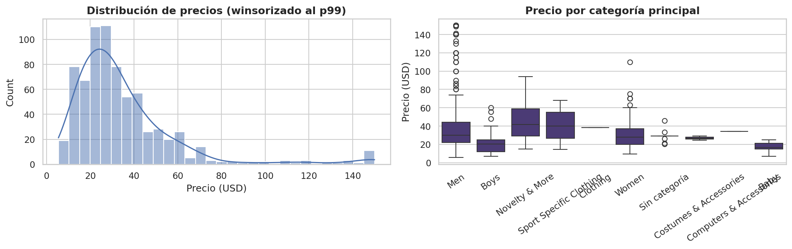

### Hallazgo
La mayoría de los productos se ubica entre $20 y $40, con una cola
derecha de prendas premium ya recortada por winsorización.

### Interpretación
El catálogo es de gama media-baja en su mayoría, con pocos productos de
precio alto que podrían distorsionar un modelo de similitud si no se
tratan.

### Decisión
Se usa la versión winsorizada (`price_value_winsorized`) como input del
pipeline de features (sección 9), no el precio crudo.

### 8.2 Comportamiento de usuarios

El dataset no permite un análisis de comportamiento de usuarios
individuales (no hay identificador de usuario — ver sección 5.3). El
análisis de comportamiento se hace, en cambio, a nivel de reseña
agregada: 97.6% de las 6.288 reseñas provienen de compras verificadas
(`verifiedPurchase = True`), y la longitud y los votos útiles de las
reseñas se relacionan positivamente entre sí, aunque con alta
dispersión.

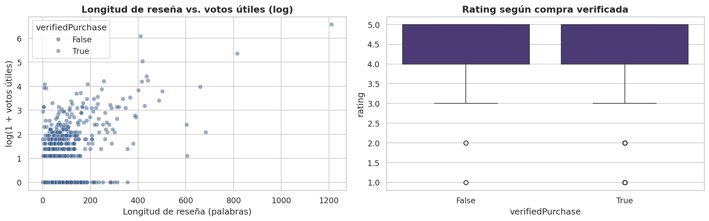

### Hallazgo
No se observan diferencias sustanciales en el rating otorgado entre
compras verificadas y no verificadas.

### Interpretación
`verifiedPurchase` no introduce un sesgo sistemático relevante sobre la
calificación — es una señal de confianza, no de tendencia hacia rating
más alto o más bajo.

### 8.3 Comportamiento de productos

**Marcas.** 285 marcas distintas para 728 productos — un catálogo muy
fragmentado, con una larga cola de marcas con pocos productos.

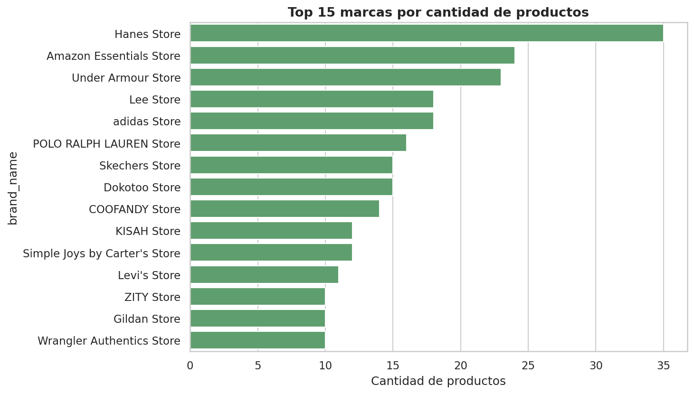

### Hallazgo
La fragmentación de marcas es alta: ninguna marca domina el catálogo.

### Interpretación
Un recomendador que dependiera fuertemente de señales agregadas por
marca tendría poca base estadística para la mayoría de las marcas
(*cold start* de marca).

### Impacto
Refuerza la necesidad de un componente de contenido (texto, categoría,
atributos del producto) que no dependa de tener muchos productos por
marca para funcionar.

### Decisión
En el pipeline de features (sección 9) se aplica *bucketing* de marcas
poco frecuentes (`RareCategoryBucketer`, `min_freq=3`) antes de
codificarlas con One-Hot Encoding.

**Categorías.** `main_category` está fuertemente concentrada: "Men"
(454 productos, 62.4%), "Women" (162, 22.3%), y siete categorías
menores que suman el 15.3% restante.

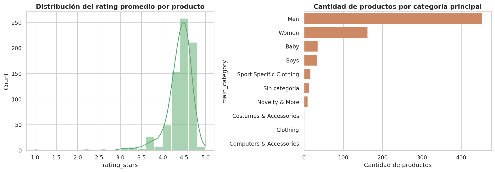

### 8.4 Ratings, reviews e interacciones

**Rating por reseña.** Distribución fuertemente desbalanceada hacia
valores altos:

| Rating | Reseñas | % |
|---:|---:|---:|
| 1★ | 157 | 2.5% |
| 2★ | 55 | 0.9% |
| 3★ | 413 | 6.6% |
| 4★ | 1.318 | 21.0% |
| 5★ | 4.345 | 69.1% |

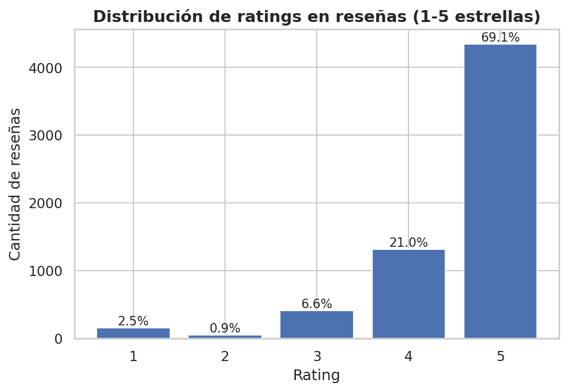

### Hallazgo
El 90.1% de las reseñas son de 4-5 estrellas; la razón 5★/1★ es de
27.7x.

### Interpretación
Es un patrón habitual en e-commerce (sesgo de autoselección: quien
compra y no tiene problemas rara vez deja reseña), no una anomalía del
dataset.

### Impacto
Si en una iteración futura se entrenara un clasificador de sentimiento
sobre `rating`, sería necesario aplicar estratificación o balanceo de
clases para evitar que el modelo colapse prediciendo siempre
"positivo".

**Reseñas por producto.** Mediana de 10 reseñas por producto, máximo 19,
32 productos (4.4% del catálogo) sin ninguna reseña asociada, y 74
productos (10.6% de los que sí tienen reseñas) con menos de 5.

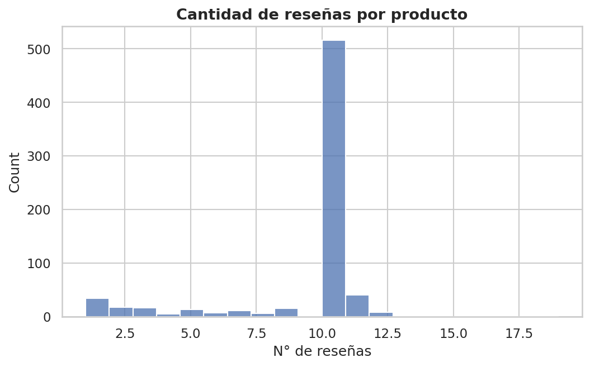

### Hallazgo
La densidad de reseñas por producto es relativamente uniforme (producto
del diseño del scraping), pero existe un subconjunto no trivial de
productos con muy pocas reseñas.

### Interpretación
Ese subconjunto representa el escenario de *cold start de producto*: un
componente que dependa solo de señal colaborativa-implícita (rating
agregado, sentimiento) será poco confiable para esos productos.

### Decisión
Justifica, junto con el hallazgo de fragmentación de marcas (8.3), la
elección de un enfoque híbrido de contenido + colaborativo-implícito
(sección 10), en vez de depender de un solo tipo de señal.

### 8.5 Relaciones relevantes

| Relación | Correlación | Interpretación |
|---|---:|---|
| Precio vs. rating promedio del producto | −0.151 | Débil; el precio prácticamente no predice satisfacción del cliente |
| Rating (reviews) vs. `sentiment_score` | 0.365 | Positiva moderada; el sentimiento del texto está alineado con el rating numérico, pero no es redundante |

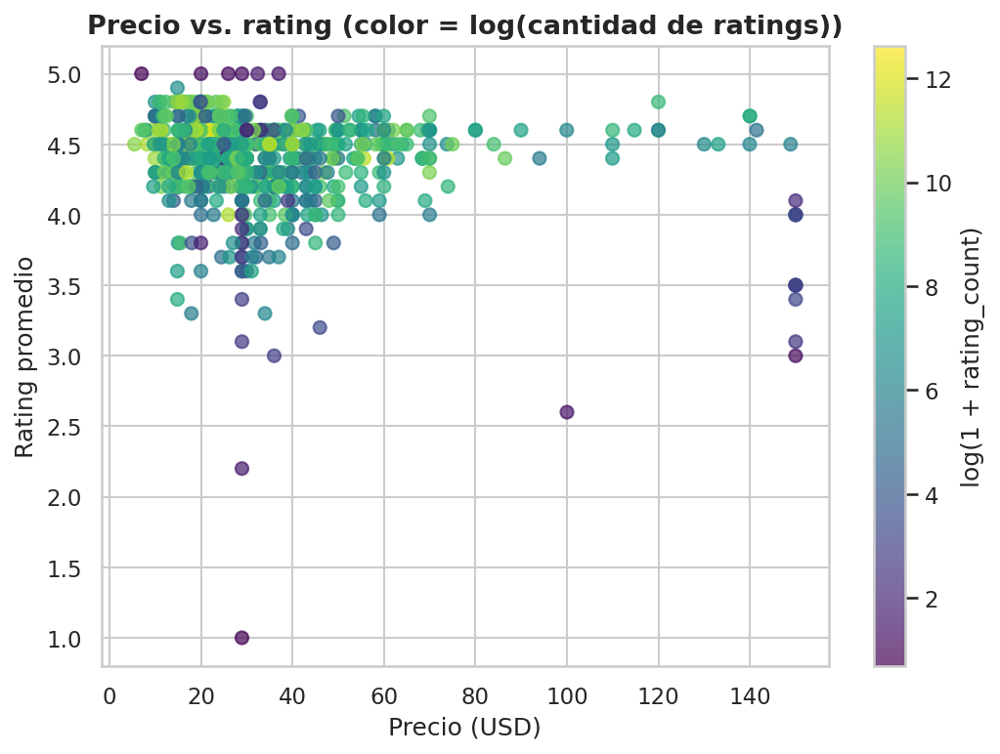
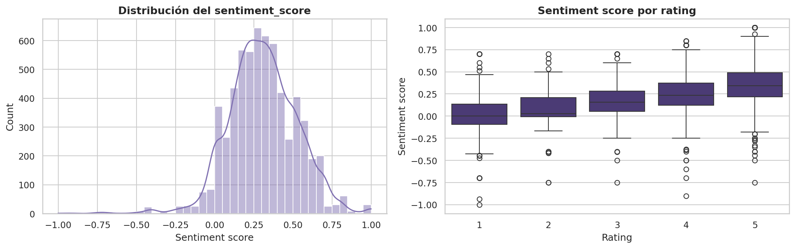

### Hallazgo
La correlación rating–sentimiento es positiva pero moderada (0.365), no
cercana a 1.

### Interpretación
El texto de la reseña aporta información que el rating numérico por sí
solo no captura completamente (por ejemplo, reseñas de 5 estrellas con
comentarios mixtos).

### Impacto
Justifica usar `sentiment_score` como señal adicional (no redundante)
en el score de popularidad del Modelo B (sección 10.3), en vez de
apoyarse solo en el rating.

### 8.6 Principales insights

1. El catálogo está fragmentado en 285 marcas y concentrado en la
   categoría "Men" (62.4%) → un enfoque solo colaborativo o solo basado
   en marca tendría cobertura pobre.
2. El desbalance hacia reseñas positivas (90.1% de 4-5★) es estructural
   del canal (compras verificadas, autoselección), no un defecto de
   captura.
3. El precio no predice el rating (correlación −0.151); el sentimiento
   del texto aporta señal no redundante frente al rating (correlación
   0.365 con el rating, no 1.0).
4. Un 4.4% del catálogo no tiene ninguna reseña y un 10.6% adicional
   tiene menos de 5 — el sistema debe funcionar razonablemente incluso
   sin señal colaborativa-implícita para esos productos.

Estos cuatro insights son la base empírica directa de la sección 10
(estrategia de recomendación).

---

## 9. Feature Engineering

Ejecutado en [`notebooks/02_feature_engineering.ipynb`](../notebooks/02_feature_engineering.ipynb),
implementado de forma reutilizable en `src/features/transformers.py`,
`src/features/build_features.py`, y orquestado también por
`src/pipeline/train_pipeline.py` (función `build_feature_pipeline`).

### 9.1 Variables originales

Punto de partida: `products_clean.csv` (23 columnas) unido a una
agregación de `reviews_clean.csv` a nivel producto (`aggregate_reviews_by_product`),
generando una tabla maestra (`df_master`) con una fila por `asin`.

### 9.2 Variables seleccionadas

**Numéricas** (12, escaladas con `StandardScaler` tras imputación por
mediana):
`price_value_winsorized`, `rating_stars_num`, `rating_count_log`,
`recent_purchases_log`, `n_reviews`, `bayesian_rating`, `avg_sentiment`,
`std_sentiment`, `pct_positive_reviews`, `pct_negative_reviews`,
`pct_verified`, `avg_helpful_votes_log`.

**Categóricas** (3, codificadas con `OneHotEncoder(handle_unknown="ignore")`):
`main_category`, `availability_clean`, `brand_name_bucketed`.

**Texto** (2 campos, vectorizados por separado con `TfidfVectorizer`):
`content_text` (combinación de título, categoría, marca, bullets y
descripción del producto) y `voice_of_customer_text` (texto concatenado
de todas las reseñas del producto).

### 9.3 Variables descartadas

`seller_page_url`, `brand_page_url`, `default_variant/0`,
`default_variant/1`, `default_variant/2`: metadatos de navegación sin
relevancia analítica para similitud de contenido. `list_price`,
`rating_stars`, `rating_count`, `recent_purchases`, `availability`,
`breadcrumbs` (versiones de texto libre): reemplazadas por sus
contrapartes parseadas numéricamente (sección 7.4).

### 9.4 Features derivadas

| Feature | Origen | Propósito |
|---|---|---|
| `bayesian_rating` | `compute_bayesian_rating()` sobre `avg_rating_reviews` y `n_reviews` | Corrige el sesgo de productos con pocas reseñas pero rating extremo (fórmula estilo IMDb) |
| `rating_count_log`, `recent_purchases_log`, `avg_helpful_votes_log` | `log1p()` sobre variables de conteo con cola larga | Estabiliza la escala para `StandardScaler` |
| `brand_name_bucketed` | `RareCategoryBucketer(min_freq=3)` sobre `brand_name` | Evita explosión dimensional del One-Hot (285 marcas → ~59 + "Otros") |
| `content_text` | `TextCombiner` sobre título (peso x2), categoría, marca, bullets y descripción | Campo único listo para `TfidfVectorizer` |
| `pct_positive_reviews`, `pct_negative_reviews`, `avg_sentiment`, `std_sentiment` | Agregación de `reviews_clean.csv` por `productASIN` | Señal colaborativa-implícita a nivel producto |

### 9.5 Transformaciones

`RareCategoryBucketer` y `TextCombiner` (`src/features/transformers.py`)
son transformadores compatibles con `scikit-learn`
(`BaseEstimator` + `TransformerMixin`), por lo que se integran
nativamente al `Pipeline` sin código ad-hoc. `DataFrameColumnSelector`
adapta una columna de texto de un DataFrame al formato 1D que espera
`TfidfVectorizer` dentro de un `ColumnTransformer`.

### 9.6 Representación de productos

El `ColumnTransformer` combina los tres bloques (numérico + categórico +
2×TF-IDF) en una matriz esparsa de **687 columnas** (verificado en la
ejecución real del notebook 02). Un paso final de `TruncatedSVD`
(`n_components=100`) reduce esa matriz a una representación **densa de
100 dimensiones por producto**, reteniendo el **95.8%** de la varianza
(verificado con una curva de varianza explicada acumulada sobre 250
componentes antes de fijar el valor final — figura `19_svd_explained_variance.png`).

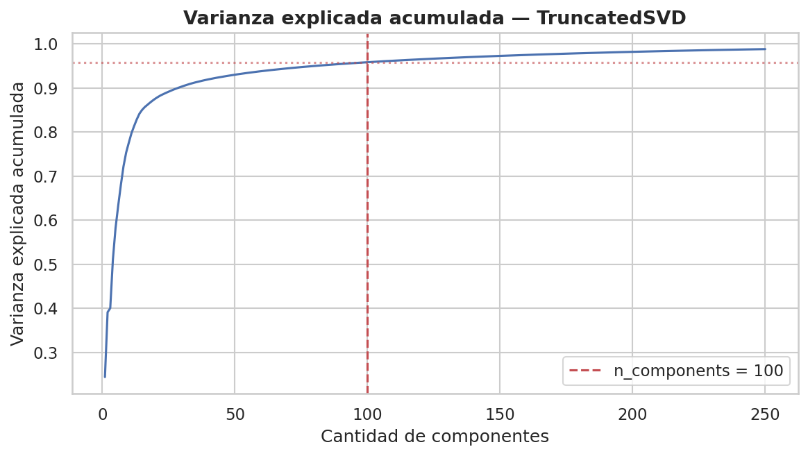

### Hallazgo
Con 100 componentes se retiene el 95.8% de la varianza total.

### Interpretación
Es un compromiso razonable entre compresión (de 687 a 100 dimensiones) y
preservación de información para el cálculo de similitud coseno del
Modelo A (sección 10.4).

### 9.7 Prevención de data leakage

No aplica en sentido estricto de *train/test split*: el proyecto no
divide el catálogo en train/test porque los modelos no se entrenan
supervisadamente sobre una variable objetivo con hold-out (el
`ContentBasedRecommender` no "aprende" parámetros a partir de una
etiqueta; el `PopularityRecommender` calcula un score determinístico).
El `TruncatedSVD` sí se ajusta (`fit`) sobre la matriz completa de
features, lo cual es el uso estándar de esta técnica en sistemas de
recomendación de este tipo (no hay una variable objetivo cuya
información pueda "filtrarse" hacia atrás).

### 9.8 Pipeline de transformación

```python
Pipeline([
    ("preprocessing", Pipeline([
        ("bucket_brand", RareCategoryBucketer(...)),
        ("combine_content_text", TextCombiner(...)),
    ])),
    ("features", ColumnTransformer([
        ("numeric", Pipeline([SimpleImputer, StandardScaler]), NUMERIC_FEATURES),
        ("categorical", OneHotEncoder(handle_unknown="ignore"), CATEGORICAL_FEATURES),
        ("content_text", Pipeline([DataFrameColumnSelector, TfidfVectorizer]), ["content_text"]),
        ("voice_of_customer", Pipeline([DataFrameColumnSelector, TfidfVectorizer]), ["voice_of_customer_text"]),
    ])),
    ("reduce_dim", TruncatedSVD(n_components=100)),
])
```

Esta definición existe en dos lugares del repositorio con la misma
estructura: `notebooks/02_feature_engineering.ipynb` (exploratorio, con
la validación de varianza explicada) y
`src/pipeline/train_pipeline.py::build_feature_pipeline()` (reutilizable,
sin outputs exploratorios). El pipeline completo, ya entrenado, se
serializa en `models/feature_engineering_pipeline.joblib` — ver sección
15 para su rol en inferencia.

### Validación cualitativa (hallazgo honesto, no maquillado)

Para un producto de referencia ("4/5 Pack Mens Polo Shirts..."), los 5
vecinos más similares en el espacio de 100 dimensiones incluyen una
campera y un jean junto a dos remeras de golf — no los 5 son polos
estrictamente.

### Hallazgo
Palabras genéricas del dominio (`"men"`, `"casual"`, `"lightweight"`)
tienen alta frecuencia en todo el corpus y compiten con términos
distintivos (`"polo"`, `"golf"`) dentro del espacio TF-IDF + SVD.

### Interpretación
Es una limitación real del enfoque TF-IDF + SVD con vocabulario de
dominio muy repetitivo, documentada explícitamente en el notebook 02 en
lugar de ocultarla.

### Decisión
Se documenta como mejora futura (sección 23): evaluar *stopwords*
específicas del dominio moda/e-commerce, mayor peso relativo a
`about_item`, o un re-ranking post-similitud filtrando primero por
`main_category`.

---

## 10. Estrategia de recomendación

Implementada en `src/models/recommenders.py`, entrenada y comparada en
[`notebooks/03_modeling.ipynb`](../notebooks/03_modeling.ipynb).

### 10.1 Problema de recomendación

Como se estableció en la sección 2, el dataset no permite modelar
preferencias por usuario individual. El problema de recomendación que
este proyecto resuelve es, específicamente:

- **Recomendación item-to-item** ("dado que el usuario está viendo el
  producto X, ¿qué otros productos le podrían interesar?"), y
- **Recomendación no-personalizada** ("¿cuáles son los mejores productos
  del catálogo, independientemente de quién pregunte?"), para los casos
  en que no hay ningún producto de referencia (usuario nuevo, página de
  inicio).

### 10.2 Baseline

El **Modelo B (Popularity)** cumple el rol de baseline: es la estrategia
más simple posible que aun así incorpora las tres señales de calidad
disponibles (rating, sentimiento, volumen). Cualquier componente de
personalización debe poder justificarse frente a este baseline con
evidencia, no solo con intuición — lo cual se hace formalmente en la
sección 12.

### 10.3 Popularity-Based Recommender

**Concepto:** ranking no-personalizado ("Top Picks" / "Trending Now").

**Inputs:** `products_master` (tabla con `bayesian_rating`,
`avg_sentiment`, `n_reviews` por producto).

**Algoritmo:** normalización min-max de tres señales y combinación
lineal ponderada:

```
score = 0.5 · norm(bayesian_rating) + 0.3 · norm(avg_sentiment) + 0.2 · norm(log1p(n_reviews))
```

Los pesos (0.5 / 0.3 / 0.2) reflejan que el rating corregido por volumen
(`bayesian_rating`) es la señal principal de calidad, el sentimiento es
una segunda fuente más rica pero también más ruidosa (surge de NLP sobre
texto libre), y el volumen aporta una señal de confianza/popularidad
adicional.

**Representación:** vector de 1 score escalar por producto.

**Cálculo:** `PopularityRecommender._fit()` calcula el score una vez al
instanciar la clase y ordena el catálogo completo; `recommend(k,
main_category=None)` devuelve el top-`k` (opcionalmente filtrado por
categoría).

**Output:** lista de `k` ASINs con su `popularity_score`, idéntica para
cualquier consulta (o para cualquier consulta dentro de la misma
categoría, si se usa el filtro).

**Ventajas:** no requiere ningún producto de referencia (funciona en
cold start total de usuario); computacionalmente trivial (`O(1)` por
consulta, tras un `fit` inicial `O(n log n)`); interpretable.

**Limitaciones:** no se adapta al producto que el usuario está mirando;
depende de tener reseñas agregadas por producto (no funciona para
productos sin ninguna reseña, sección 8.4).

**Comportamiento esperado:** la misma lista de productos para
cualquier consulta (o cualquier consulta dentro de una categoría, en la
variante filtrada) — verificado empíricamente en la sección 12.3
mediante la métrica *Catalog Coverage@10*.

### 10.4 Content-Based Recommender

**Concepto:** recomendación personalizada por similitud de contenido.

**Inputs:** la matriz densa de 100 dimensiones por producto
(`product_features_matrix.npy`, sección 9.6) y un ASIN de consulta.

**Algoritmo:** similitud coseno entre el vector del producto consultado
y los vectores de todos los demás productos del catálogo.

**Representación:** vector de 100 dimensiones por producto (features de
contenido + señal colaborativa-implícita agregada, ya combinadas por el
pipeline de la sección 9).

**Cálculo:** `ContentBasedRecommender._similarity()` calcula, de forma
perezosa y cacheada, la matriz de similitud coseno completa (728×728)
la primera vez que se solicita una recomendación; `recommend(asin, k)`
ordena esa fila de similitud y excluye al propio producto consultado.

**Output:** lista de `k` ASINs con su `similarity_score` (0 a 1),
distinta para cada producto de consulta.

**Ventajas:** se adapta al producto consultado (verdadera
personalización item-to-item); funciona incluso para productos sin
reseñas, siempre que tengan texto/categoría/marca (mitiga el cold start
de producto identificado en la sección 8.4).

**Limitaciones:** requiere un producto de referencia (no resuelve cold
start total de usuario); sensible a vocabulario genérico del dominio
(limitación documentada en la sección 9.6); el cálculo de la matriz de
similitud completa es `O(n²)`, aceptable para un catálogo de 728
productos pero a revisar si el catálogo creciera significativamente.

**Comportamiento esperado:** listas de recomendación distintas según el
producto consultado, con alta cobertura del catálogo a lo largo de
múltiples consultas — verificado en la sección 12.3.

### 10.5 Justificación metodológica

La comparación **Content-Based (personalizado) vs. Popularity
(no-personalizado)** no es una limitación del proyecto sino la
comparación metodológicamente correcta dado el dataset disponible: es
el mismo tipo de comparación que se usa en la literatura de sistemas de
recomendación para justificar si vale la pena personalizar frente a un
baseline no-personalizado. La sección 12 formaliza esa comparación con
métricas y significancia estadística.

---

## 11. Modelado

### 11.1 Preparación

Insumos: `product_features_matrix.npy` (728×100), `product_features_index.csv`
(mapeo posición ↔ ASIN) y `products_master.csv` (tabla con las señales
de calidad por producto), todos generados en la sección 9. No hay
partición train/test (ver justificación en la sección 9.7): ambos
modelos se ajustan sobre el catálogo completo.

### 11.2 Entrenamiento

- **`ContentBasedRecommender`**: no tiene una fase de "entrenamiento"
  con parámetros aprendidos — su único costo computacional es calcular
  la matriz de similitud coseno 728×728 la primera vez que se pide una
  recomendación (`_similarity()`, con *lazy caching*).
- **`PopularityRecommender`**: su `_fit()` calcula el score compuesto
  (sección 10.3) y ordena el catálogo una única vez al instanciar la
  clase.

### 11.3 Configuración

Hiperparámetros usados en la ejecución de referencia (documentados en
`notebooks/03_modeling.ipynb` y reproducibles vía
`src/pipeline/train_pipeline.py`):

| Hiperparámetro | Valor | Componente |
|---|---:|---|
| `k` (tamaño de la recomendación) | 10 | Ambos modelos, en la evaluación principal |
| `w_rating` | 0.5 | `PopularityRecommender` |
| `w_sentiment` | 0.3 | `PopularityRecommender` |
| `w_volume` | 0.2 | `PopularityRecommender` |
| `n_components` (TruncatedSVD) | 100 | Pipeline de features (insumo del Content-Based) |
| `brand_min_freq` | 3 | `RareCategoryBucketer` (insumo del Content-Based) |
| `random_seed` | 42 | Todo el pipeline |

### 11.4 Artefactos generados

`models/content_based_recommender.joblib`,
`models/popularity_recommender.joblib`,
`models/feature_engineering_pipeline.joblib` — ver sección 15 para el
detalle de cada uno.

---

## 12. Evaluación

### 12.1 Estrategia de evaluación

El dataset no tiene historial de interacciones de usuario, por lo que no
es posible calcular *precision/recall* clásico contra un ground truth
real de preferencias. La estrategia adoptada, implementada en
`src/models/evaluation.py` y ejecutada en
[`notebooks/03_modeling.ipynb`](../notebooks/03_modeling.ipynb) y
[`notebooks/04_evaluation_and_validation.ipynb`](../notebooks/04_evaluation_and_validation.ipynb),
usa **cada uno de los 728 productos del catálogo como consulta**,
genera el top-10 de cada modelo para esa consulta, y calcula 4 métricas
proxy sobre el conjunto completo de 728 consultas.

### 12.2 Métricas

| Métrica | Definición | Qué indica un valor alto |
|---|---|---|
| **Category Precision@10** | Fracción de las 10 recomendaciones que comparten `main_category` con el producto consultado, promediada sobre las 728 consultas | Alta coherencia temática de las recomendaciones |
| **Catalog Coverage@10** | Proporción de productos del catálogo (728) que aparecen en *al menos una* lista de recomendación, a lo largo de todas las consultas | Alta capacidad de personalización (un valor bajo indica que el modelo devuelve casi siempre la misma lista) |
| **Intra-list Diversity@10** | `1 − similitud coseno promedio` entre los pares de ítems dentro de cada lista recomendada, promediado sobre las consultas | Listas variadas internamente (no redundantes) |
| **Avg. Quality@10** | `bayesian_rating` promedio de todos los ítems recomendados, a lo largo de todas las consultas | El modelo prioriza productos de buena calidad percibida |

Las cuatro métricas están implementadas como funciones puras en
`src/models/evaluation.py` (`category_precision_at_k`,
`catalog_coverage_at_k`, `intra_list_diversity`,
`avg_recommendation_quality`), testeadas unitariamente en
`tests/test_models.py`.

### 12.3 Resultados

Resultados reales, tomados de `data/processed/model_evaluation_results.csv`
(idénticos a los registrados como métricas en el run de MLflow
`49a129b63ca84b1d80b8788ef064a2e5` — ver sección 14):

| Modelo | Category Precision@10 | Catalog Coverage@10 | Intra-list Diversity@10 | Avg. Quality@10 |
|---|---:|---:|---:|---:|
| A — Content-Based | **0.824** | **0.993** | 0.297 | 4.521 |
| B — Popularity (global) | 0.509 | 0.014 | **0.381** | **4.726** |

`notebooks/03_modeling.ipynb` además evalúa una tercera variante,
**Popularity filtrado por categoría** (restringe el ranking a la
categoría del producto consultado antes de tomar el top-10), que no se
serializa como modelo aparte pero ilustra el efecto de agregar contexto
mínimo al baseline:

| Variante | Category Precision@10 | Catalog Coverage@10 | Intra-list Diversity@10 | Avg. Quality@10 |
|---|---:|---:|---:|---:|
| B — Popularity (filtrado por categoría) | 1.000* | 0.107 | 0.418 | 4.689 |

\* *Precisión de categoría = 1.0 por construcción (la categoría es un
filtro duro aplicado antes de rankear, no un logro del modelo).*

### 12.4 Comparación de modelos

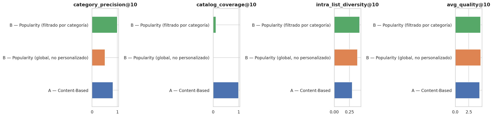

La sensibilidad de las dos métricas más determinantes (Category
Precision@10 y Catalog Coverage@10) se verificó además para K ∈ {5, 10,
15, 20}:

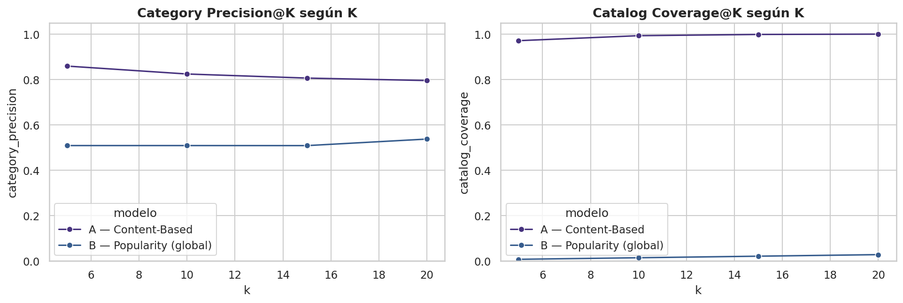

### Hallazgo
Las conclusiones de la sección 12.3 se mantienen estables en todo el
rango de K evaluado — la brecha de cobertura de catálogo entre ambos
modelos, en particular, no se cierra para ningún valor de K.

### 12.5 Interpretación

1. **Cobertura de catálogo — la diferencia más contundente.** El Modelo
   A recomienda, a lo largo de las 728 consultas, el 99.3% del catálogo
   en algún momento; el Modelo B (global) apenas el 1.4% — devuelve
   virtualmente la misma lista de ~10 productos a cualquier consulta.
   No es un defecto del Modelo B: es su naturaleza de baseline
   no-personalizado.
2. **Coherencia de categoría sin forzarla.** El Modelo A logra 0.824 de
   precisión de categoría sin que la categoría sea un filtro explícito
   — la similitud de contenido "descubre" la coherencia temática por sí
   sola. El Modelo B (global) cae a 0.509 porque devuelve la misma lista
   fija a consultas de categorías distintas.
3. **Calidad promedio: ventaja esperable para el Modelo B.** Al
   optimizar explícitamente por rating bayesiano y sentimiento, el
   Modelo B recomienda productos de mayor calidad promedio (4.726 vs.
   4.521) — es su fortaleza específica y coherente con su diseño.
4. **Diversidad intra-lista: el Modelo A es algo menos diverso** (0.297
   vs. 0.381), esperable en un modelo optimizado para similitud (listas,
   por diseño, más homogéneas entre sí).

**Conclusión de la comparación:** ningún modelo domina en todas las
métricas — cada uno resuelve un problema distinto, resultado esperado y
deseable en esta comparación. La sección 13 formaliza esta conclusión
con significancia estadística.

---

## 13. Validación

Ejecutada en [`notebooks/04_evaluation_and_validation.ipynb`](../notebooks/04_evaluation_and_validation.ipynb).

### 13.1 Estrategia

Un promedio simple (sección 12.3) no dice si una diferencia entre
modelos es estadísticamente significativa o si podría deberse al azar
de qué 728 productos componen este catálogo particular. La Etapa 2
formalizó esto con dos técnicas no paramétricas (apropiadas porque
`category_precision` por consulta está acotada en [0, 1] y no sigue una
distribución normal):

1. **Intervalos de confianza bootstrap** (2.000 réplicas, 95% de
   confianza) sobre la media de `category_precision` por consulta.
2. **Test de Wilcoxon de rangos con signo**, pareado por producto, para
   contrastar formalmente si la diferencia entre el Modelo A y el
   Modelo B es significativa.

### 13.2 Validaciones implementadas

**Intervalos de confianza (bootstrap, 95%):**

| Modelo | Media | IC 95% inferior | IC 95% superior |
|---|---:|---:|---:|
| A — Content-Based | 0.8242 | 0.8029 | 0.8440 |
| B — Popularity (global) | 0.5085 | 0.4832 | 0.5363 |

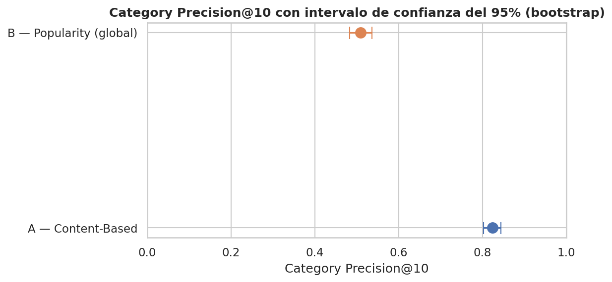

### Hallazgo
Los intervalos de confianza de ambos modelos no se superponen.

### Interpretación
Es evidencia visual de que la diferencia observada no es producto del
azar, confirmada formalmente por el test de hipótesis siguiente.

**Test de hipótesis (Wilcoxon pareado):**

- H0: no hay diferencia entre `category_precision` del Modelo A y del
  Modelo B (mediana de diferencias pareadas por producto = 0).
- H1: sí hay diferencia.

| Estadístico | Valor |
|---|---:|
| W | 17.065,5 |
| p-value | ≈ 1.00 × 10⁻⁸² |
| n pares | 728 |
| Diferencia de medias (A − B) | 0.316 |

### Hallazgo
`p-value ≈ 1.0 × 10⁻⁸²`, muy por debajo de α = 0.05 → se rechaza H0.

### Interpretación
La diferencia observada entre el Modelo A (0.824) y el Modelo B (0.509)
en Category Precision@10 no es producto del azar de qué 728 productos
componen el catálogo — es una diferencia estructural, atribuible al
diseño de cada modelo, y estadísticamente robusta.

**Robustez frente a la semilla de remuestreo:** el intervalo de
confianza se recalculó con 5 semillas distintas (0, 1, 42, 123, 2024);
la media y los límites variaron solo en el 3er-4to decimal en todos los
casos (tabla completa en el notebook 04), confirmando que el resultado
no es un artefacto de la semilla elegida.

### 13.3 Tests

El proyecto tiene **28 tests unitarios/de integración** (`pytest`),
distribuidos en 5 archivos bajo `tests/`:

| Archivo | Tests | Cubre |
|---|---:|---|
| `test_cleaning.py` | 7 | Funciones de parsing de `src/data/cleaning.py` (precio, rating, fecha, categoría, disponibilidad) |
| `test_features.py` | 4 | Agregación de reseñas, rating bayesiano, `RareCategoryBucketer`, `TextCombiner` |
| `test_models.py` | 12 | `ContentBasedRecommender`, `PopularityRecommender`, y las 4 métricas + bootstrap + Wilcoxon de `src/models/evaluation.py` |
| `test_pipeline.py` | 1 | Integración end-to-end de `src/pipeline/train_pipeline.py` (usa un directorio temporal para no pisar los artefactos de producción) |
| `test_app.py` | 4 | Smoke tests de `app.py` vía `streamlit.testing.v1.AppTest`: las 3 páginas y las interacciones de filtro/slider corren sin excepciones |

Verificado en este informe: `pytest tests/ -q` ejecuta los 28 tests
correctamente.

### 13.4 CI

`.github/workflows/ci.yml` corre en cada `push`/`pull request` a `main`
que modifique `src/`, `tests/`, `requirements.txt` o el propio workflow.
Instala las dependencias desde cero (matriz Python 3.11 / 3.12), corre
`pytest tests/ -v` (incluyendo el test de integración del pipeline
completo) y valida la sintaxis de `app.py` con `py_compile`.

### 13.5 Resultados

Todos los tests pasan en el estado actual del repositorio (28/28). El
plan de validación completo — qué métricas monitorear en producción, con
qué umbrales de alerta, con qué frecuencia, y el protocolo de test A/B
para cuando existan datos de usuario reales — está documentado como
artefacto independiente en
[`docs/VALIDATION_PLAN.md`](../docs/VALIDATION_PLAN.md).

---

## 14. MLflow

### 14.1 Experiment tracking

`src/pipeline/train_pipeline.py::run_pipeline()` usa MLflow con backend
SQLite (`mlflow.set_tracking_uri("sqlite:///mlflow.db")`), registrado
bajo el experimento `shopsmart-recommender`. El backend de archivos
plano (`./mlruns`) fue evaluado primero pero descartado: MLflow ≥ 3.x lo
marca como deprecado, y SQLite es el backend recomendado actualmente
para proyectos nuevos (comentario explícito en el código).

### 14.2 Runs

Al momento de escribir este informe, `mlflow.db` contiene **1 run**
finalizado (`status=FINISHED`), `run_id`
`49a129b63ca84b1d80b8788ef064a2e5`, correspondiente a la configuración
de referencia documentada en la sección 11.3. Es posible generar runs
adicionales con hiperparámetros distintos ejecutando
`python -m src.pipeline.train_pipeline` con otros argumentos de línea de
comandos (ver sección 16); cada ejecución crea un nuevo run comparable
en `mlflow ui`.

### 14.3 Parámetros

Registrados con `mlflow.log_params()` en cada run:
`brand_min_freq`, `n_components`, `w_rating`, `w_sentiment`, `w_volume`,
`random_seed` — los mismos 6 hiperparámetros documentados en la sección
11.3.

### 14.4 Métricas

Registradas con `mlflow.log_metric()`, con el prefijo del modelo en el
nombre: `content_based__category_precision_at_10`,
`content_based__catalog_coverage_at_10`,
`content_based__intra_list_diversity_at_10`,
`content_based__avg_quality_at_10`, y los mismos 4 nombres con el
prefijo `popularity__`. Los valores del run registrado coinciden
exactamente con los de la tabla de la sección 12.3.

### 14.5 Artefactos

Cada run adjunta, vía `mlflow.log_artifact()`:
`feature_engineering_pipeline.joblib`, `content_based_recommender.joblib`,
`popularity_recommender.joblib`, `model_evaluation_results.csv`.

### 14.6 Trazabilidad

Cada run queda vinculado a: los hiperparámetros exactos que lo generaron
(14.3), las métricas resultantes (14.4), y una copia de los artefactos
serializados (14.5) — permitiendo comparar cualquier ejecución futura
contra este baseline sin volver a correr nada manualmente. Esta
trazabilidad es la base del criterio de rollback documentado en
[`docs/VALIDATION_PLAN.md`](../docs/VALIDATION_PLAN.md#6-criterio-de-rollback).

**Evaluación crítica: ¿debería `mlflow.db` mantenerse versionado en el
repositorio?**

| A favor | En contra |
|---|---|
| Permite a cualquiera que clone el repo explorar el historial de runs con `mlflow ui` sin tener que reentrenar nada | Un archivo binario SQLite no es "diffable" en revisiones de Git — cada nuevo run reescribe el archivo completo |
| Da trazabilidad inmediata del baseline documentado en este informe | Si varias personas corren el pipeline en paralelo y commitean, `mlflow.db` genera conflictos de merge difíciles de resolver |
| El archivo es pequeño (≈860 KB con 1 run) en la etapa actual del proyecto | Crecerá de forma no acotada a medida que se acumulen runs de experimentación, sin compresión ni limpieza automática |

**Recomendación:** mantenerlo versionado **mientras el proyecto siga
siendo de un único colaborador o de bajo volumen de runs** (el caso
actual, con 1 run), por el valor pedagógico de tener el historial
disponible sin configuración adicional. Si el proyecto escala a varios
colaboradores entrenando en paralelo, migrar a un *tracking server*
remoto (MLflow con backend Postgres/MySQL, o un servicio gestionado) y
excluir `mlflow.db` del control de versiones — es una decisión de
arquitectura pendiente de revisión, no un defecto del estado actual.

## 15. Persistencia de modelos

### 15.1 Modelos generados

| Archivo | Tamaño | Contenido |
|---|---:|---|
| `models/content_based_recommender.joblib` | 4.7 MB | Instancia de `ContentBasedRecommender`: la matriz de features (728×100), el índice de productos, y la matriz de similitud coseno cacheada tras el primer `recommend()` |
| `models/popularity_recommender.joblib` | 2.9 MB | Instancia de `PopularityRecommender`: la tabla `products_master` ya rankeada por `popularity_score` |
| `models/feature_engineering_pipeline.joblib` | 576 KB | El `Pipeline` de `scikit-learn` completo de la sección 9.8, ya ajustado (`fit`) sobre el catálogo |

### 15.2 Feature pipeline

`feature_engineering_pipeline.joblib` es el artefacto que permite
transformar productos nuevos (o el mismo catálogo) de forma idéntica y
reproducible sin volver a ejecutar el notebook 02 — incluye los
transformadores ajustados (`RareCategoryBucketer` con las marcas
frecuentes ya detectadas, los vocabularios de ambos `TfidfVectorizer`, el
`OneHotEncoder` con las categorías vistas, y la proyección `TruncatedSVD`
ya calculada).

### 15.3 Serialización

Los tres artefactos se serializan con `joblib.dump()` (estándar para
objetos de `scikit-learn` con arrays de NumPy, más eficiente que
`pickle` puro para este tipo de contenido) tanto en los notebooks como
en `src/pipeline/train_pipeline.py::run_pipeline()`.

### 15.4 Uso durante inferencia

`app.py` es el único consumidor de inferencia de estos artefactos: carga
`content_based_recommender.joblib` y `popularity_recommender.joblib` con
`joblib.load()` (cacheados con `@st.cache_resource`, sección 17) y llama
directamente a sus métodos `.recommend()`. **`app.py` no vuelve a cargar
ni a usar `feature_engineering_pipeline.joblib`**: la demo consume los
modelos ya entrenados (que ya contienen la matriz de features resuelta),
no productos crudos que necesiten pasar por el pipeline de features en
tiempo real. El pipeline de features se reutilizaría si en una futura
iteración se quisiera transformar un producto completamente nuevo
(fuera del catálogo actual) antes de calcularle recomendaciones — ese
flujo no está implementado en la demo actual.

## 16. Pipeline end-to-end

El flujo real, verificado en el código (no idealizado), es:

```
data/raw/{products,reviews}.csv
        ↓  (src/data/load_data.py)
        ↓  (src/data/cleaning.py: clean_products, clean_reviews)
df_products, df_reviews limpios
        ↓  (src/features/build_features.py: aggregate_reviews_by_product,
        ↓   compute_bayesian_rating)
df_master (tabla unificada producto + señal colaborativa-implícita)
        ↓  (src/features/transformers.py + sklearn ColumnTransformer + TruncatedSVD)
product_features_matrix (728×100)
        ↓
        ├── ContentBasedRecommender (src/models/recommenders.py)
        └── PopularityRecommender   (src/models/recommenders.py)
                ↓  (src/models/evaluation.py)
        Evaluación (4 métricas × 728 consultas)
                ↓
        Persistencia (joblib) + registro en MLflow
                ↓
        app.py (Streamlit) — consume los modelos ya entrenados
```

**Dos implementaciones de este mismo flujo conviven en el repositorio:**

1. **Los notebooks (`01`→`04`)**: ejecución interactiva, con
   exploración, gráficos y documentación narrativa de cada decisión —
   pensados para lectura y aprendizaje, no para automatización.
2. **`src/pipeline/train_pipeline.py`**: ejecución no interactiva del
   mismo flujo (limpieza → features → ambos modelos → evaluación),
   parametrizable por línea de comandos, con tracking en MLflow —
   pensado para reproducibilidad y CI, no para exploración.

Ambas comparten el mismo código de limpieza (`src/data/cleaning.py`) y
de features (`src/features/`), por lo que no son implementaciones
paralelas divergentes: `train_pipeline.py` reutiliza exactamente las
mismas funciones que los notebooks 01 y 02 documentan paso a paso. Esto
se verificó directamente en este informe: al ejecutar
`python -m src.pipeline.train_pipeline`, las 4 métricas de evaluación
resultantes coinciden, hasta el cuarto decimal, con las obtenidas en
`notebooks/03_modeling.ipynb` (sección 12.3).

## 17. Aplicación Streamlit

Implementada en [`app.py`](../app.py) (raíz del repositorio, requisito
de Streamlit Community Cloud para el despliegue automático) y
configurada visualmente en `.streamlit/config.toml`.

### 17.1 Arquitectura

```
Usuario
   ↓
Streamlit (app.py)
   ↓
joblib.load() de content_based_recommender.joblib y popularity_recommender.joblib
   ↓ (cacheado con @st.cache_resource / @st.cache_data)
ContentBasedRecommender.recommend() / PopularityRecommender.recommend()
   ↓
Tabla de recomendaciones (título, marca, categoría, precio, rating bayesiano)
```

No hay una etapa de "Feature Engineering en vivo" en este flujo (a
diferencia de lo que un diagrama genérico de recomendadores podría
sugerir): los modelos ya cargados contienen toda la representación
vectorial resuelta de antemano (sección 15.4).

### 17.2 Inputs

Interacción del usuario en la página **"🔍 Explorar y Recomendar"**:
filtro de categoría (`st.selectbox`), selección de un producto de
referencia (`st.selectbox`), y tamaño de la recomendación `K`
(`st.slider`, rango 3–15).

### 17.3 Procesamiento

Para el producto seleccionado, la app llama en paralelo (una por cada
pestaña de la UI):
`content_model.recommend(selected_asin, k=k)`,
`popularity_model.recommend(k=k)` (ranking global), y
`popularity_model.recommend(k=k+1, main_category=query_category)`
(ranking filtrado por categoría, excluyendo el propio producto
consultado).

### 17.4 Recomendaciones

Cada resultado se cruza contra `products_master.csv` para mostrar
título, marca, categoría, precio y `bayesian_rating` en una tabla
(`st.dataframe`), sin exponer directamente el score interno de
similitud/popularidad en la tabla principal.

### 17.5 Outputs

Tres pestañas comparables lado a lado (Content-Based / Popularity
global / Popularity misma categoría) en la página principal; en la
página **"📊 Evaluación de Modelos"**, la tabla y los gráficos de barra
de `model_evaluation_results.csv`, más la imagen
`22_bootstrap_confidence_intervals.png` si está disponible; en
**"ℹ️ Acerca del Proyecto"**, la documentación de la decisión de diseño
central del proyecto (sección 2) y las instrucciones de ejecución local.

**Estado verificado:** las 3 páginas y las interacciones (filtro de
categoría, slider K) se probaron con `streamlit.testing.v1.AppTest`
(`tests/test_app.py`) y no generan excepciones sobre el estado actual
de los artefactos del repositorio.

**Demo pública:** desplegada en Streamlit Community Cloud —
[master-7jmeeookyenuvjmnmnvnapp.streamlit.app](https://master-7jmeeookyenuvjmnmnvnapp.streamlit.app/).

---

## 18. Resultados finales

| Métrica | A — Content-Based | B — Popularity (global) |
|---|---:|---:|
| Category Precision@10 | 0.824 (IC95% [0.803, 0.844]) | 0.509 (IC95% [0.483, 0.536]) |
| Catalog Coverage@10 | 0.993 | 0.014 |
| Intra-list Diversity@10 | 0.297 | 0.381 |
| Avg. Quality@10 | 4.521 | 4.726 |
| Significancia de la diferencia en precisión | Wilcoxon pareado, p ≈ 1.0×10⁻⁸² (n=728) | — |

Artefactos verificables: `data/processed/model_evaluation_results.csv`,
run de MLflow `49a129b63ca84b1d80b8788ef064a2e5`.

## 19. Interpretación de resultados

**Resultado experimental:** el Modelo A supera al Modelo B en
personalización (Category Precision@10, Catalog Coverage@10) con
diferencia estadísticamente significativa; el Modelo B supera al Modelo
A en calidad promedio de lo recomendado.

**Interpretación:** esto no es una contradicción ni un empate —
confirma que ambos modelos capturan señales genuinamente distintas
(similitud de contenido vs. calidad agregada) y que **ninguno de los dos
subsume al otro**. Es la evidencia que justifica, en la sección 20, por
qué la arquitectura de producción recomendada combina ambos en lugar de
elegir uno solo.

## 20. Trade-offs técnicos

| Decisión | A favor | En contra | Resolución adoptada |
|---|---|---|---|
| Sin filtrado colaborativo basado en usuario | Metodológicamente correcto dado el dataset | Pierde la técnica de recomendación más estudiada en la literatura | Documentado explícitamente como restricción de datos, no como omisión |
| `TruncatedSVD` a 100 componentes | Reduce ruido y costo de similitud coseno | Pierde 4.2% de la varianza; dificulta interpretar cada dimensión individualmente | Aceptado: el costo de interpretabilidad es bajo frente a la ganancia de eficiencia (sección 9.6) |
| Winsorización solo en `price_value` (no en conteos) | Preserva la cola larga informativa de popularidad | El precio winsorizado pierde la distinción entre productos extremadamente premium | Aceptado: el precio es la variable que más distorsiona la similitud por escala; los conteos se manejan mejor con log-transform |
| `mlflow.db` versionado en Git | Trazabilidad inmediata sin configuración | No es "diffable"; no escala a múltiples colaboradores en paralelo | Mantenido por ahora (sección 14.6), con recomendación explícita de migrar si el proyecto escala |
| `data/processed/` y `models/` versionados en Git (no en `.gitignore`) | La demo de Streamlit funciona sin reentrenar en el hosting | Contradice la práctica estándar de no versionar artefactos de ML | Aceptado deliberadamente: es la única forma de tener un link público funcional sin backend adicional (documentado en `.gitignore`) |

## 21. Limitaciones

1. **Sin identificador de usuario** (sección 2, 5.3): el sistema no
   puede aprender preferencias individuales ni hacer recomendaciones
   basadas en historial de compra real.
2. **Sin evaluación online**: todas las métricas de la sección 12 son
   proxies offline; no hay CTR, tasa de conversión ni ningún dato de
   comportamiento real de usuarios frente al sistema.
3. **Vocabulario genérico de dominio en el Content-Based** (sección 9.6):
   la similitud de contenido puede confundir productos de la misma
   familia general (ropa masculina casual) aunque no sean del mismo
   subtipo exacto (polo vs. campera).
4. **`n_reviews` acotado (máximo 19 por producto)**: la señal
   colaborativa-implícita (`bayesian_rating`, `avg_sentiment`) se
   calcula sobre un volumen de reseñas por producto bajo, lo que limita
   su robustez estadística individual.
5. **1 solo run de MLflow disponible** en el estado actual del
   repositorio: aún no hay un historial de experimentación con múltiples
   configuraciones de hiperparámetros comparadas entre sí.

## 22. Riesgos

- **Cambio silencioso en la calidad de los datos** (nuevo scraping con
  formato distinto) rompería los parsers de `src/data/cleaning.py` sin
  previo aviso — mitigado parcialmente por los tests de
  `test_cleaning.py`, pero sin una validación de esquema explícita sobre
  datos de entrada nuevos.
- **Crecimiento del catálogo**: el cálculo de similitud coseno completo
  (`O(n²)`) en `ContentBasedRecommender` es viable para 728 productos
  pero necesitaría revisión (ej. *approximate nearest neighbors*) si el
  catálogo creciera en uno o dos órdenes de magnitud.
- **Conflictos de merge en `mlflow.db`** si más de una persona corre el
  pipeline y commitea en paralelo (sección 14.6).
- **Deriva de la demo pública**: la demo en Streamlit Community Cloud
  depende de que `models/` y `data/processed/` permanezcan versionados y
  sincronizados con el código de `app.py` — un cambio en la forma de
  `products_master.csv` sin actualizar `app.py` rompería la demo en
  producción sin que el CI actual lo detecte (el CI corre tests, no la
  demo desplegada).

## 23. Mejoras futuras

1. **Vocabulario de dominio para TF-IDF**: incorporar *stopwords*
   específicas de moda/e-commerce y/o mayor peso a `about_item` para
   mitigar la limitación documentada en la sección 9.6.
2. **Re-ranking híbrido explícito**: combinar `similarity_score` del
   Modelo A con `popularity_score` del Modelo B en un único ranking
   ponderado, y comparar esa tercera variante contra las dos actuales
   con las mismas 4 métricas.
3. **Instrumentación de eventos reales** (clicks, tiempo en página,
   agregado al carrito) si la demo evoluciona hacia un producto con
   usuarios reales, habilitando el protocolo de test A/B ya documentado
   en `docs/VALIDATION_PLAN.md`.
4. **Validación de esquema de datos de entrada** (ej. con `pandera` o
   `great_expectations`) antes de correr `clean_products`/`clean_reviews`,
   para detectar cambios de formato del scraping de forma temprana.
5. **Backend de MLflow remoto** si el proyecto pasa a tener más de un
   colaborador entrenando en paralelo (sección 14.6).

## 24. Conclusiones

**Qué problema se resolvió:** construir un sistema de recomendación
funcional para un catálogo de e-commerce sin identificador de usuario,
comparando explícitamente dos estrategias con roles complementarios en
lugar de forzar una única solución.

**Qué metodología funcionó:** el enfoque híbrido basado en producto
(contenido + señal colaborativa-implícita agregada) permitió construir
dos modelos genuinamente distintos y compararlos con evidencia
cuantitativa, en vez de elegir uno por intuición.

**Cuál fue el mejor enfoque:** ninguno de los dos modelos es "el mejor"
en términos absolutos (sección 19) — la evidencia respalda un uso
combinado por posición: **Content-Based** como motor principal en
contextos donde existe un producto de referencia, **Popularity** como
*fallback* para cold start total de usuario.

**Qué evidencia respalda esa conclusión:** la comparación cuantitativa
de la sección 12 y la validación estadística de la sección 13 (test de
Wilcoxon pareado, p ≈ 1.0×10⁻⁸², n=728; intervalos de confianza bootstrap
sin superposición; robustez confirmada frente a 5 semillas de
remuestreo distintas).

**Qué limitaciones permanecen:** la sección 21 las detalla — en
particular, la ausencia de identificador de usuario es una restricción
estructural del dataset que ninguna decisión de modelado puede resolver,
solo mitigar.

**Qué se debería hacer en una siguiente iteración:** las cinco mejoras
de la sección 23, priorizando la instrumentación de eventos reales si el
proyecto avanza hacia un entorno con usuarios reales — es el paso que
habilitaría, por primera vez, una evaluación online genuina en lugar de
las métricas proxy offline usadas hasta ahora.

## 25. Referencias internas del proyecto

**Notebooks:**
- [`notebooks/01_data_quality_eda.ipynb`](../notebooks/01_data_quality_eda.ipynb) — Calidad de datos + EDA
- [`notebooks/02_feature_engineering.ipynb`](../notebooks/02_feature_engineering.ipynb) — Pipeline de features
- [`notebooks/03_modeling.ipynb`](../notebooks/03_modeling.ipynb) — Entrenamiento y comparación de modelos
- [`notebooks/04_evaluation_and_validation.ipynb`](../notebooks/04_evaluation_and_validation.ipynb) — Evaluación formal

**Código fuente:**
- [`src/data/`](../src/data/) — Carga y limpieza (`load_data.py`, `cleaning.py`)
- [`src/features/`](../src/features/) — Transformadores y agregaciones (`transformers.py`, `build_features.py`)
- [`src/models/`](../src/models/) — Recomendadores y métricas (`recommenders.py`, `evaluation.py`)
- [`src/pipeline/train_pipeline.py`](../src/pipeline/train_pipeline.py) — Pipeline reproducible end-to-end

**Modelos y datos:**
- [`models/`](../models/) — Artefactos serializados (`.joblib`)
- [`docs/VALIDATION_PLAN.md`](../docs/VALIDATION_PLAN.md) — Plan de validación documentado
- [`docs/DOCUMENTATION_AUDIT.md`](../docs/DOCUMENTATION_AUDIT.md) — Auditoría de documentación del repositorio

**Tests y aplicación:**
- [`tests/`](../tests/) — Suite de 28 tests (`pytest`)
- [`app.py`](../app.py) — Demo funcional en Streamlit
